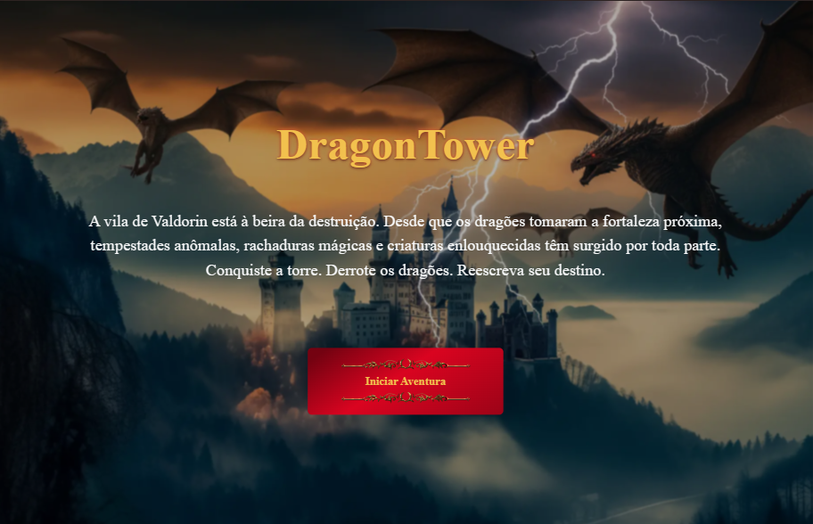
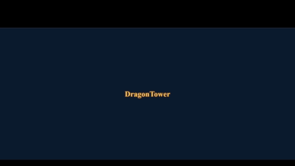
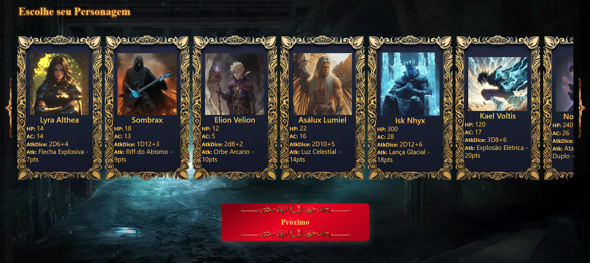
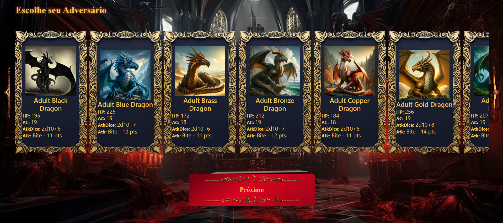
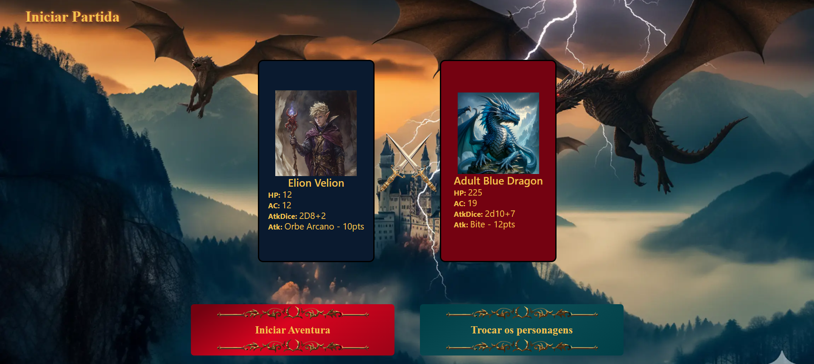
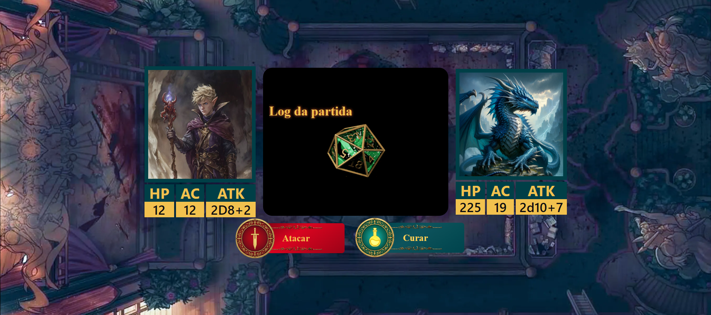
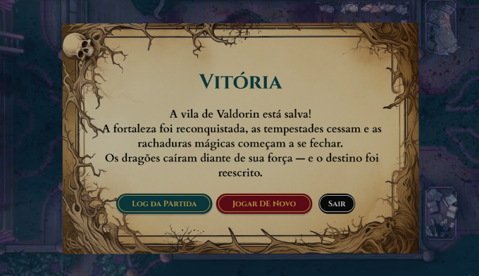
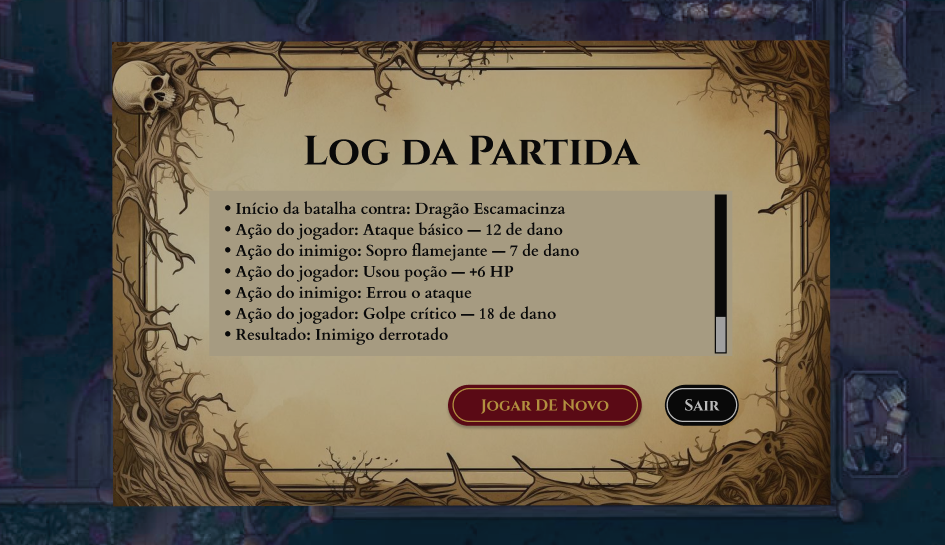

# 🐉 Mini Jogo RPG — DragonTower



---

## 🛠️ Badges


---

## 📑 Índice

* [Descrição do projeto](#-descrição-do-projeto)
* [Funcionalidades](#-funcionalidades)
* [Como os usuários podem utilizá-lo](#-como-os-usuários-podem-utilizá-lo)
* [Autores](#-autores-do-projeto)

---

## 📘 Descrição do projeto

### Introdução

**DragonTower** é um mini-jogo de RPG de combate por turnos (*player vs monster*) com estética medieval. O projeto foi desenvolvido utilizando **HTML, CSS, Bootstrap e JavaScript**, consumindo a **API DnD 5e** para obter informações dinâmicas sobre dragões.

O objetivo principal é praticar **lógica de programação**, **manipulação do DOM**, **controle de estado com localStorage** e **consumo de API**, aplicados em um contexto de jogo.

### Status do projeto

🚧 **Em desenvolvimento** — foco atual na implementação e refinamento da lógica de combate em JavaScript.

### Link de exibição

🔗 [DragonTower](https://mini-jogo-rpg.vercel.app/)

---

## ⚙️ Funcionalidades

### 1️⃣ Tela Inicial (Index)

* Apresenta o título **DragonTower** com animação inicial.
* Introduz a contextualização da história do jogo.



---

### 2️⃣ Seleção de Personagem

* Exibe personagens jogáveis com atributos base:

  * HP
  * ATK
  * ATK Dice
  * Dano
* Armazena o personagem selecionado no **localStorage**.



---

### 3️⃣ Seleção de Dragão

* Lista dragões carregados dinamicamente da **API DnD 5e**.
* Exibe atributos principais dos monstros.
* Salva o dragão escolhido no **localStorage**.



---

### 4️⃣ Pré-jogo

* Exibe os combatentes selecionados.
* Permite alterar personagem ou dragão antes do combate.



---

### 5️⃣ Combate por Turnos

* Sistema de turnos (Player vs Dragon).
* Exibição das informações do personagem e dragão:
  * HP atual
  * Ataque
  * Dano
* Sistema de rolagem de dados.
* Narrador textual descrevendo cada ação.
* Cálculo de dano baseado em atributos e dados.



---

### 6️⃣ Modal de Fim de Partida

* Exibe o resultado: **vitória** ou **derrota**.
* Opções disponíveis:

  * Jogar novamente
  * Ver log da partida
  * Sair



---

### 7️⃣ Modal de Log da Partida

* Registro completo do combate:

  * Rolagens de dados
  * Dano causado
  * Ordem dos turnos




## 🔗 Consumo de Endpoints – D&D 5e API

Este projeto utiliza a **[D&D 5e API](https://www.dnd5eapi.co/)** como fonte de dados para carregar informações e imagens de criaturas do universo de *Dungeons & Dragons*, com foco específico em **dragões**.

---

## 📡 Endpoint Base

Todos os dados são consumidos a partir do domínio base:

https://www.dnd5eapi.co
---

## 🐉 Listagem de Monstros

O projeto inicia realizando uma requisição para o endpoint que retorna **todos os monstros disponíveis** na API:

```js
fetch('https://www.dnd5eapi.co/api/monsters')
```
#Detalhes de Cada Dragão

Depois de filtrar os dragões, o projeto faz uma nova requisição para buscar os detalhes completos de cada criatura, utilizando o index fornecido pela API:

fetch(`https://www.dnd5eapi.co/api/monsters/${cadaDragon.index}`)


#Esse endpoint retorna informações como:

Classe de Armadura (AC)

Pontos de Vida (HP)

Ataques e dados de ataque

Dano

Habilidades especiais

Esses dados alimentam diretamente o sistema de combate por turnos do jogo.

#Imagens dos Dragões

As imagens dos dragões são carregadas dinamicamente utilizando o caminho retornado pela própria API:

https://www.dnd5eapi.co${dragon.imagem}

## 🚀 Como os usuários podem utilizá-lo

### Instalação

1. Clone este repositório:

   ```bash
   git clone (https://github.com/Galves-gi/mini-jogo-rpg)
   ```

2. Acesse a pasta do projeto:

   ```bash
   cd mini-jogo-rpg
   ```

3. Abra o arquivo `index.html` no navegador.

### Outras referências

* Documentação da API DnD 5e
* MDN Web Docs (HTML, CSS e JavaScript)

---

## 👩‍💻 Autora do projeto

* **Galves-gi**

---
